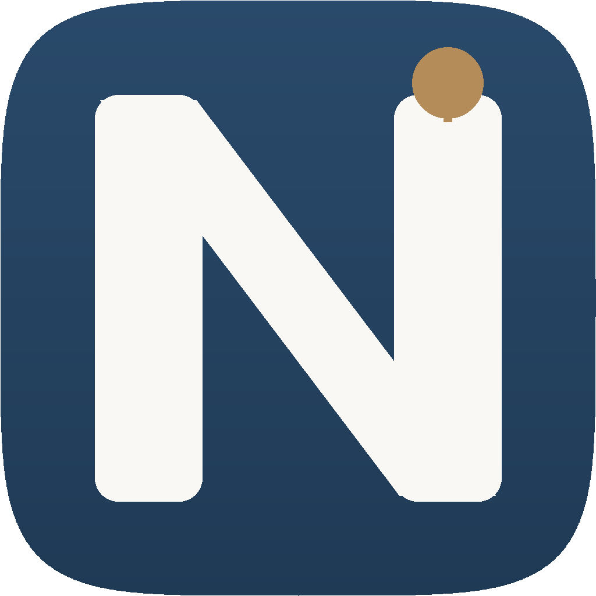

# NotebookAI branding

## Mark

The NotebookAI mark is a stylized **N** with a single accent node at the top-right of the right-hand vertical bar. The node + thin connector form an **i** glyph, encoding both letters of the product name (NotebookAI), and reads as a knowledge-graph node — an edge connecting back to the page below.



## Palette

| Role | Hex | Usage |
|---|---|---|
| Ink Blue (top) | `#2a4a6b` | Primary brand color, light theme accent, gradient top |
| Ink Blue (bottom) | `#1f3a55` | Gradient bottom for depth on large icons |
| Cream | `#faf8f5` | Foreground letterform, light theme background |
| Amber | `#b48c5a` | Single accent — the "AI node" — used sparingly for warmth |

The palette comes from the frontend Phase 8 design — warm gray base with an ink-blue accent, evoking a pre-digital scholarly aesthetic. The amber accent is reserved exclusively for the icon's "AI node" and the wiki-only-mode badge — it signals "intelligent, present" without going neon.

## Geometry

Master canvas is 1024×1024. The icon body is a superellipse (n=5) — a "squircle" closer to Apple's iOS app-icon shape than a CSS `border-radius`. The N letterform sits inside a 16% safe-area padding so it survives macOS's icon mask without clipping.

## Generating

The full icon set is rendered by [`desktop/sidecar/generate_icons.py`](../desktop/sidecar/generate_icons.py). Run from `backend/`:

```bash
uv run python ../desktop/sidecar/generate_icons.py
```

Outputs:

| Path | Format | Purpose |
|---|---|---|
| `desktop/src-tauri/icons/{16,24,32,48,64,96,128,256,512}x{...}.png` | PNG | Tauri Linux/cross-platform |
| `desktop/src-tauri/icons/128x128@2x.png` | PNG | Tauri retina |
| `desktop/src-tauri/icons/icon.png` | PNG (1024) | Tauri master |
| `desktop/src-tauri/icons/icon.icns` | ICNS | macOS app bundle |
| `desktop/src-tauri/icons/icon.ico` | ICO | Windows app + installer |
| `frontend/public/favicon.ico` | ICO | Web browser favicon |
| `frontend/app/icon.png` | PNG (512) | Next.js auto-favicon |
| `docs/img/icon.png` | PNG (1024) | Branding asset for docs/READMEs |

The script is idempotent — safe to re-run on every release.

## Usage rules

- **Don't recolor the mark.** Use the palette as-is; don't substitute the amber accent with green or red — those have semantic meaning elsewhere in the product (lint findings, build status).
- **Maintain the safe area** when placing the icon on a contrasting background — give it at least 16% of its width as padding.
- **The squircle shape is the canvas.** macOS will mask to its own iOS-style superellipse; on Windows and Linux the rounded corners are baked into the PNGs.

## Accessibility

The N + amber node has a contrast ratio of >7:1 against the ink-blue background, exceeding WCAG AAA for graphic objects. The amber accent passes WCAG AA against both ink-blue (5.2:1) and cream (4.6:1).
